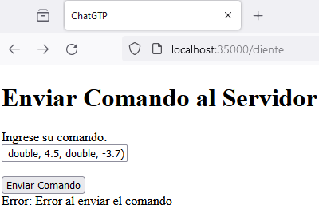

# AREP_parcial1
### Instrucciones de Ejecución
* Clone el repositorio desde GitHub:

```
git clone https://github.com/sergiolopezzl/AREP_Parcial1.git
```

* Navegue al directorio del proyecto: 

```
cd AREP_Parcial1
```

* Compile el proyecto y descargue las dependencias con Maven: 

```
mvn clean package
```

* Ejecute el servidor utilizando el siguiente comando: 

```
java -cp target/classes org.example.ReflectiveChatGTP
```

```
java -cp target/classes org.example.ServiceFacade

```

Una vez que el servidor esté en funcionamiento, acceda a 
http://localhost:35000/cliente desde su navegador para comenzar a escribir comandos.

### Pruebas
* Se realizó la petición a http://localhost:35000/cliente
